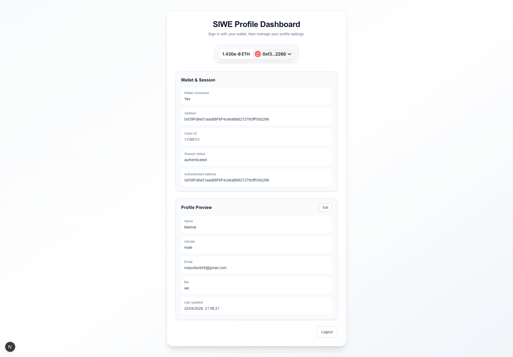

# rainbow-siwe

一个基于 `Next.js 16 + RainbowKit + wagmi + NextAuth + SIWE` 的钱包登录示例项目。用户可以连接钱包，使用以太坊签名完成 SIWE（Sign-In With Ethereum）认证，登录后查看当前会话状态，并编辑自己的个人资料。

这个项目适合用来做以下事情：

- 学习钱包连接与 Web3 登录流程
- 作为 SIWE 登录模板的起点项目
- 验证 `RainbowKit` 与 `NextAuth` 的集成方式
- 演示“钱包身份 + 业务资料表单”的基础组合

<p align="center">
  
</p>

## 项目是干什么的

这个项目实现了一个简单的 SIWE Profile Dashboard：

1. 用户通过 `RainbowKit` 连接钱包
2. 用户使用钱包签名，完成基于 `SIWE` 的登录
3. 服务端通过 `NextAuth` 校验签名并建立会话
4. 登录成功后，页面展示当前钱包地址、链 ID、会话状态
5. 用户可以编辑并保存个人资料，包括姓名、性别、邮箱和简介

当前项目的资料存储是**内存存储**，也就是保存在服务端运行时的 `Map` 里，重启服务后数据会丢失。它更偏向 demo / 原型验证，而不是生产版持久化实现。

## 技术栈

- `Next.js 16`：应用框架，使用 App Router
- `React 19`：前端 UI
- `TypeScript`：类型安全
- `Tailwind CSS 4`：页面样式
- `next-auth`：会话管理与认证流程
- `siwe`：以太坊签名登录协议校验
- `@rainbow-me/rainbowkit`：钱包连接 UI
- `wagmi`：链上连接与账户状态管理
- `viem`：底层 EVM 工具支持
- `@tanstack/react-query`：为 RainbowKit / wagmi 提供查询能力
- `react-hook-form`：资料表单管理与校验

## 项目结构

```text
app/
  api/
    auth/[...nextauth]/route.ts   # NextAuth 认证接口
    profile/route.ts              # 资料读取 / 保存接口
  layout.tsx                      # 全局布局与 Provider 注入
  page.tsx                        # 首页入口

components/
  providers.tsx                   # Session、Wagmi、RainbowKit、SIWE Provider
  siwe-status.tsx                 # 主页面，展示连接状态、会话与资料模块
  profile-form.tsx                # 资料编辑表单
  profile-preview.tsx             # 资料预览卡片

hooks/
  use-profile.ts                  # 资料拉取、保存、编辑状态管理

lib/
  auth.ts                         # NextAuth + SIWE 校验配置
  wagmi.ts                        # 钱包 / 链网络配置
  profile-store.ts                # 内存版资料存储

types/
  profile.ts                      # 资料相关类型定义
```

## 怎么使用

### 1. 安装依赖

```bash
npm install
```

### 2. 配置环境变量

在项目根目录创建 `.env.local`：

```bash
NEXTAUTH_URL=http://localhost:3000
NEXTAUTH_SECRET=your-nextauth-secret
NEXT_PUBLIC_WALLETCONNECT_PROJECT_ID=your-walletconnect-project-id
NEXT_PUBLIC_SEPOLIA_RPC_URL=your-sepolia-rpc-url
```

说明：

- `NEXTAUTH_URL`：NextAuth 校验域名时会用到，开发环境通常填写 `http://localhost:3000`
- `NEXTAUTH_SECRET`：NextAuth 的会话密钥
- `NEXT_PUBLIC_WALLETCONNECT_PROJECT_ID`：WalletConnect 项目 ID
- `NEXT_PUBLIC_SEPOLIA_RPC_URL`：Sepolia 测试网 RPC 地址

### 3. 启动开发环境

```bash
npm run dev
```

然后打开：

```text
http://localhost:3000
```

### 4. 使用流程

1. 点击连接钱包
2. 选择钱包并连接到应用
3. 按提示进行签名登录
4. 登录成功后查看当前地址和会话状态
5. 点击 `Edit` 编辑资料并保存

## 亮点

- 支持标准 SIWE 登录流程，不是普通 Web2 邮箱密码认证
- `RainbowKit + wagmi + NextAuth` 集成链路清晰，适合二次开发
- 登录后自动把钱包地址映射为当前认证身份
- 提供了完整的资料读取、编辑、保存闭环
- 前端表单包含基础校验，例如邮箱格式、名称长度、简介长度
- 代码结构比较清楚，认证、钱包、资料、UI 分层明确

## 当前实现特点与限制

- 当前链配置为 `Sepolia`
- 当前资料存储为内存 `Map`，服务重启后不会保留
- 当前更适合做 Demo、教学、集成验证
- 如果要用于生产，建议把 `profile-store.ts` 替换为数据库实现，例如 PostgreSQL、MySQL、SQLite 或 Prisma

## 后续可扩展方向

- 接入数据库做资料持久化
- 增加头像上传
- 增加 ENS / 链上资料展示
- 支持更多链和网络切换
- 为资料接口补充鉴权边界与输入校验
- 优化页面文案、多语言和 UI 细节

## 适合谁

- 想做 Web3 登录功能的前端 / 全栈开发者
- 想学习 SIWE 标准接入方式的开发者
- 想把钱包身份和业务资料系统结合起来的项目
